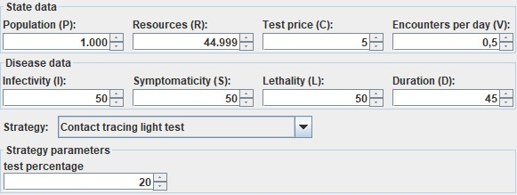

# Discussione del progetto

## Struttura del simulatore

Il simulatore si avvale di una serie di parametri che gli vengono passati nel costruttore
*-normalmente passati dal Frame `SimulatorSettings`-*
e li utilizza per l'esecuzione degli incontri e il calcolo della prosecuzione della malattia
giornalmente fino a quando non si verificano uno dei possibili **finali** specificati dal documento di progetto:
- Economic_Collapse: Risorse Esaurite (`Resources<=0`).
- All_Healed: Malattia debellata, nel quale **al più una persona** sopravvive.
- All_Dead: La Malattia vince, ovvero **tutta** la popolazione diviene **Nera**.  

### ExecuteDay
Tutti gli incontri e la prosecuzione della malattia si svolgono nel metodo `executeDay`,
che va richiamato per ogni giorno da simulare finché non si verifica uno **finali** specificati precedentemente.

Per ogni giorno il simulatore calcola il **Vd** come da specifiche
e lo utilizza per estrarre dalla lista di persone attualmente **abilitate al movimento** (`notQuarantinedPersons`)
coppie di persone, per simularne l'incontro.

#### Incontri

Se avviene un incontro tra una persona in grado di trasmettere il virus (`canInfect`) e una persona sana,
l'incontro può generare dei cambiamenti nello *"status"* di quella sana, a seconda dei parametri inseriti.

In caso d'incontro il simulatore, deciderà casualmente *-ma sfruttando la percentuale di `infectivity`-*
se un individuo sano verrà infettato;

Se questo avviene, verrà deciso in modo analogo
se la persona svilupperà i sintomi (*basandosi su `symptomaticity`*) 
e in caso se la persona morirà (*basandosi su `lethality`*)

In base alle scelte precedenti calcolerà anche il numero del giorno entro in cui quella persona svilupperà sintomi
e il giorno in cui morirà.

*La scelta di "tirare i dadi" direttamente al momento dell'infezione
risparmia il problema legato alla scelta del momento in cui tirarli
e inoltre risparmia anche eventuali controlli per vedere se sono già stati tirati o no.*

- **NOTA**:
Tutti i dati delle Persone citati finora servono solo al simulatore e alla GUI,
ma non sono modificabili (*e spesso neanche accessibili*) dalle strategie.

#### Prosecuzione malattia

Una volta avvenuti tutti gli incontri il simulatore controllerà tutte le persone 
che soddisfano il requisito di essere vive **e** infette allo stesso tempo;

Per ognuno di essi c'è un contatore dei giorni passati da quanto questa Persona è stata infettata.

Ogni giorno questo contatore viene aumentato, e in base al numero dei giorni passati e
alle decisioni prese nel momento dell'infezione, *-una volta raggiunto il giorno estratto
nel passo precedente-*, cambierà lo status della persona.

#### Controllo finale

Dopo aver simulato gli incontri e la prosecuzione della malattia il simulatore
effettua un ultimo controllo in funzione delle risorse e della popolazione in vita e
ritorna l'outcome dell'esecuzione del giorno, che può essere uno dei finali specificati precedentemente.

### TestVirus

Oltre a executeDay l'altro metodo pubblico fornito dal simulatore è "testVirus"
(*il metodo usato per il tampone in pratica*):

Questo metodo semplicemente prende in input una Persona e ne controlla lo stato:
- se l'individuo è sintomatico viene restituito `true` senza neanche effettuare il test.
- se l'individuo non è sintomatico il metodo restituisce `true`/`false`
a seconda del fatto che quella persona sia o meno in grado di infettare altre persone.

### Callbacks/Strategie

Tutti gli eventuali eventi rilevanti nel simulatore vengono segnalate a una lista di **callback**
tramite chiamate a dei metodi.

Le callBack sono implementazioni dell'interfaccia `SimulatorCallBack`,
e contengono metodi per ricevere eventi del tipo:
- il passaggio di una persona da rosso a blu
- il passaggio di una persona da giallo a rosso
- la fine di un giorno
- un incontro tra due persone.

Le callback sono state pensate per far comunicare il Simulatore con la GUI,
ma sono anche state utilizzate per implementare le Strategie.

In particolare la classe astratta `Strategy` implementa `SimulatorCallBack`.

Per evitare conflitti dovuti alla presenza di più strategie però
il Simulatore si occupa di controllare che non vengano messe più Strategie nella lista delle callback.

Inoltre durante la chiamata dei vari metodi delle callback fa in modo di non chiamare i metodi delle Strategie
a meno che non sia già stato scoperto il primo rosso.

**NOTA:**
*Per comodità la callback che è una strategia è anche salvata in una variabile esterna all'array delle callback,
questo evita di dover cercare la strategia nelle callback ogni volta che bisogn accerdervi.*

## Implementazione delle strategie
Nel progetto abbiamo implementato e testato diverse strategie, cercando di strutturarle in maniera 
diversificata rispetto all'altra.
Ogni strategia è dotata di una propria specializzazione in un determinato settore di
gestione della popolazione in funzione dei dati che, giorno per giorno, vengono segnalati dal simulatore
sul decorso e l'evoluzione della malattia.

Ogni strategia ha lo scopo di riconoscere (ed eventualmente modificare) lo status della persona mediante
tamponi e in funzione del suo compito e della sua struttura:

- **No Strategy**: la strategia più banale,ma anche la più semplice: sostanzialmente
si lascia andare la malattia per il suo normale decorso,senza testare o bloccare nessuno a seguito
di un criterio imposto. Gli unici costi che si sosterebbero sarebbero quelli per mettere in cura
un sintomatico presso un ospedale e sperare che "l'immunità di gregge" possa permettere alla 
popolazione di "gestire" da soli il virus nel modo migliore possibile.

- **Pecentage Lockdown and Partial Stop Spread**:Una strategia che ha il semplice compito di 
effettuare il lockdown di una certa percentuale di persone immesse da tastiera al
primo rosso/sintomatico che si presenta;ma che in
più consente di effettuare anche dei controlli preventivi sulla popolazione lasciata in
movimento laddove il numero di sintomatici dovesse salire troppo,e **solo se** la percentuale
di risorse attualmente disponibile è superiore a una seconda soglia immessa dall'utente(*nel nostro
caso è consigliata una soglia dell'almeno 35%*)tale che possa permettere
un minimo al simulatore,dopo i controlli dei tamponi,di progredire senza collassi economici.

- **Contact Tracing Light Test:** Da quando viene trovato il primo sintomatico, scorre tutta la popolazione in vita,
e per ogni sintomatico trovato analizza la sua lista degli incontri nei precedenti "developSyntomsMaxDay" giorni.
Di questi, effettua il tampone ad una percentuale data da "testPercentage",
se positivi vengono messi in quarantena fin quando non si è sicuri abbiano debellato la malattia
(o fino a quando non sviluppino sintomi). Il resto invece viene messo in quarantena preventiva senza controllo del tampone.

- **Stop Epidemy On First Red:** La strategia più "potente" di tutte, dato che si attiva fin dal principio
dell'epidemia.Non appena il simulatore abilita il flag "FirstRed" (quindi non appena la prima persona presenterà i sintomi), la strategia
entrerà in azione sottoponendo tutta la popolazione ad un lockdown preventivo che dia il tempo a tutti i
*potenziali* infetti di, eventualmente, presentare sintomi o di avere il virus in circolo,e quindi rilevabile da tampone.
Scaduto l'intervallo di "lockdown" si prosegue con un tampone a tutti coloro che ancora non hanno
presentato dei sintomi, rimettendo così in libertà esclusivamente gli individui sani.

- **Medium Controlled Lockdown:** Anche questa Strategia è stata pensata per effettuare dei 
Lockdown preventivi,e contenuti,in funzione del numero dei sintomatici attualmente
rilevati dal simulatore,ma in maniera più contenuta e preventivata rispetto alle altre strategie.
Al momento del lancio del simulatore la strategia richiederà un certo parametro da parte
dell'utente,dal nome di **"Percentual of Stop"**,come suggerisce il nome stesso,tale parametro serve
a indicare quanto tempo far aspettare,in termini di percentuale di sintomatici,
la strategia prima di farla entrare in azione.
Quando la soglia di limite viene superata,la strategia provvederà a calcolare una certa 
percentuale di persone che andranno controllate,sul numero totale di individui che in quel
preciso momento hanno la facoltà di movimento(*quindi Verdi e/o Gialli*).
Tale percentuale viene fornita dall'utente e indica in termini di percentuale
la dimensione di "default" di ogni blocco di persone in movimento su cui effettuare il controllo,
a tale valore vengono sommate ulteriori "n" persone da estrarre(*dove il parametro "n" corrisponde al numero di 
rossi rilevati dal simulatore*).
Per ognuna delle persone che ho,randomicamente,estratto ne effettuo un tampone e se risultano
essere positive,non solo si blocca l'individuo in questione,**ma anche tutte le altre persone
che quest'ultimo ha incontrato nei giorni precedenti**,poichè potrebbero essere dei "potenziali"
infetti,tali persone vengono inserite in un'apposita struttura dati:**check**,e attenderanno
il periodo minimo di incubazione prima di essere testati da un tampone ed,eventualmente,
rilasciati.
Se la strategia durante il corso della sua esecuzione dovesse notare che le risorse 
scendono al di sotto una certa soglia immessa dall'utente in percentuale
(*nel nostro caso se ne consiglia pari al 45%*),viene effettuato in ogni
caso il controllo sulle persone contenute in **check**,anche se l'intervallo di incubazione
non viene raggiunto;rilasciando i sani rilevati e tenendo fermi eventuali asintomatici,abilitando
infine un **flag booleano** che non faccia più attivare la strategia,e lasci andare ormai il tutto per il
suo normale decorso.
Seguendo questa formula riusciamo sempre a effettuare lockdown più eterogenei e regolati
in funzione del numero effettivo di sintomatici che riscontriamo nel decorso dell'epidemia,ed
eventualmente riusciamo anche ad avere una sorta  di "safe-mode" laddove il tutto stia 
richiedendo uno sforzo eccessivo,in termini di risorse.

- **Full Controlled Lockdown And Stop Spread**:la strategia in questione offre una serie di controlli in funzione
del numero di sintomatici che si presentano(*di fatto questa rimarrà in attesa di una 
percentuale di rossi minimi che si devono presentare,prima della sua attivazione*).
Una volta entrata in azione,la strategia,provvederà ad effettuare dei tamponi sulla popolazione alla ricerca degli
infetti,e non appena ne viene trovato uno(*a patto che non sia già stato testato in precedenza*),
viene fermato così come il resto delle persone che quest'ultimo ha incontrato
nei giorni precedenti,per un certo periodo minimo e preventivo di incubazione.
Una volta messe in "check" le persone,la strategia anche dovesse presentare un nuovo caso di "n" nuovi asintomatici
che superano la soglia di limite,non si ri-attiverà finchè non avrà finito di controllato le persone messe 
in lockdown preventivo.
Una strategia funzionale ma estremamente onerosa,in quanto prevede per ogni intervento numerosi test e blocchi di altrettante numerose 
persone per ogni infetto scoperto. 

- **Aggressive Contact Tracing:** una strategia,come da nome,estremamente pressante,in quanto prevede
per ogni rosso rilevato dal simulatore,la quarantena di tutte le persone incontrate dall'infetto
in questione per un certo numero di giorni minimi affinchè possa poi essere testato(*ogni
persona viene messa in "Quarantine" a patto che non sia già stata messa sotto controllo ad
un sintomatico precedente o a patto che quest'ultima non sia immune*).
Finito l'intervallo si effettuerà per ogni persona in quarantena un TestVirus/Tampone per verificarne 
l'infettività o meno,e svuotando la lista delle persone da controllare.

- **Contact Tracing Fail Safe**: una strategia che fungica come una sorta di **estensione logica** di **"Aggressive Contact
Tracing"**,tant'è che addirittura estende la classe stessa.
Per ogni "Execution Day",del simulatore,la strategia richiama i medesimi controlli della sua superclasse,Aggressive,MA aggiunge un
controllo in più;di fatto non appena la strategia si accorge che la percentuale di risorse sta,comunque,
continuando a scendere ed arriva adirittura al di sotto di una
certa soglia immessa da tastiera(*nel nostro caso se ne consiglia una percentuale pari ad almeno del 95%*)
viene effettuato un lockdown totale e preventivo,sulla falsa riga di "StopOnFirstRed" 
sperando di poter resistere economicamente e debellare l'epidemia non appena scade l'intervallo di lockdown,con un giro di
tampone generale sulla popolazione.

## Interfaccia grafica

### Settings
Avviando il programma, compare subito l'interfaccia grafica in cui inserire tutti i parametri
necessari alla simulazione e la strategia da utilizzare (compreso l'uso di nessuna strategia).
L'inserimento dei parametri è regolato tramite l'uso di Spinner, in questo modo viene limitata
l'immissione di soli caratteri numerici, ponendo anche i vincoli di intervalli a numeri interi
(o a una cifra decimale nel caso del numero di incontri **V**). È presente anche il controllo dei
valori minimi e massimi regolato tramite le Annotazioni.  
Per la scelta della strategia viene usato
invece un ComboBox e le relative strategie vengono estrapolate tramite Reflection, in modo che
ad ogni cambio o aggiunta di strategia cambi anche la voce all'interno del ComboBox. Nelle strategie
che prevedono anche un parametro da inserire, comparirà anche uno Spinner per la sua immissione.

### Simulatore testuale
La variante testuale del simulatore non è altro che il classico output testuale con formattazione, sfondo
e colori adeguati. Viene stampato il resoconto dettagliato giorno per giorno della popolazione (sani, infetti, sintomatici, guariti e deceduti)
e la variazione del fattore R0. Alla fine della simulazione, viene riportato il relativo outcome (tutti guariti,
collasso economico o tutti morti) e il riepilogo dei parametri iniziali.

### Simulatore grafico
Per la variante grafica del simulatore, sono stati usati i tool messi a disposizione da awt e swing,
facendo uso dei layout più comuni come il BoxLayout e il GridBagLayout. L'interfaccia è sostanzialmente
costituita da 2 blocchi fondamentali: la parte centrale, in cui sono visibili graficamente e in tempo
reale gli "incontri" fra le persone (contrassegnate con i loro rispettivi colori), e la parte superiore, dove 
sono stati collocati i dati relativi al simulatore aggiornati giorno dopo giorno sotto forma di barre e di grafici,
i parametri iniziali inseriti nel simulatore e uno slider per settare la velocità della simulazione.